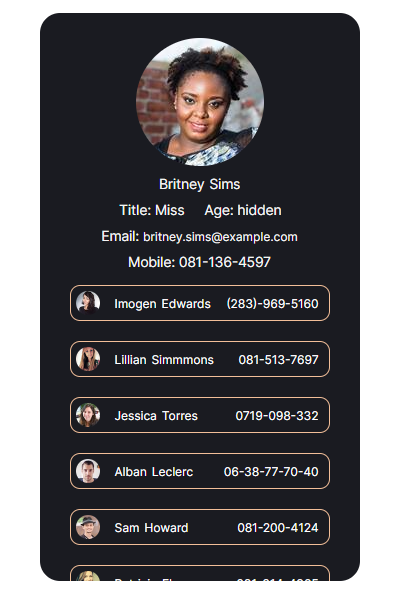

# Mobile Contacts List



The idea fo this project was for a project which used the React and css skills I already possessed to reinforce them and to practice quickly coding an app.

## What I Did
The app makes an API call to randomuser.me inside of a useEffect Hook. The returned contactlist is mapped into a state object, taking the data needed for the app.

The app is based around two components. A single contact is shown expanded with a higher level of detail while the remaining contacts show only a thumbnail, name and mobile number. If clicked on a condensed contact will become the expanded contact and centre on the screen via the expandContact function.

The age of an expanded contact initially shows as "hidden" but can be revealed with a click.

## What I Learned 

In order to centre a clicked contact on screen I had to search and found the solution to be the useRef Hook. Each ContactSm component produces a contactRef which is passed to the expandContact function which contains the code:
```
    ref.current.scrollIntoView({
      behavior: "smooth",
      block: "center",
```
that centres the clicked contact on screen as well as expanding it.